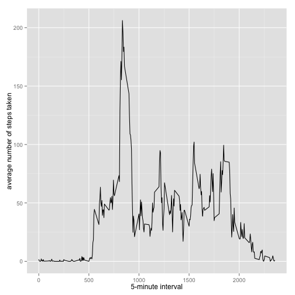

# Reproducible Research: Peer Assessment 1


## Loading and preprocessing the data


```r
dat = read.csv("activity.csv")
```


## What is mean total number of steps taken per day?


```r
stepsByDate = tapply(dat$steps, dat$date, sum)
hist(stepsByDate, 50, xlab = "Steps taken each day", main = "Histogram of Steps taken each day")
```

 

```r
meanStepsPerDay = as.integer((mean(stepsByDate, na.rm = T)))
medianStepsPerDay = median(stepsByDate, na.rm = T)
```


The mean total number of steps taken per day is 10766 (meanStepsPerDay).

The mean total number of steps taken per day is 10765 (medianStepsPerDay).


## What is the average daily activity pattern?


```r
library(ggplot2)
stepsByInt = aggregate(dat$steps, list(interval = dat$interval), mean, na.rm = T)
qplot(stepsByInt$interval, stepsByInt$x, xlab = "5-minute interval", ylab = "average number of steps taken", 
    geom = "line")
```

 

```r
maxStepIdx <- which.max(stepsByInt$x)
maxStepInt <- stepsByInt$interval[maxStepIdx]
```


The 104th (maxStepIdx) 5-minute interval, i.e., the interval of 835 (maxStepInt), contains the maximum number of steps on average across all the days in the dataset.


## Imputing missing values

#### 1. Calculate and report the total number of missing values in the dataset (i.e. the total number of rows with NAs)

```r
totMissingVals = sum(is.na(dat))
```


The total number of missing values in the dataset is 2304(totMissingVals).

#### 2. Devise a strategy for filling in all of the missing values in the dataset. The strategy does not need to be sophisticated. For example, you could use the mean/median for that day, or the mean for that 5-minute interval, etc.

The strategy is as follow:

- compute the overall average number of steps across all dates and intervals
- compute the average number of steps across all intervals for each day
- loop through each row of input data (using apply()) and do the following for each NA steps value
  - use avg steps of the same day if it is not NA
  - if avg steps of the same day is also NA, use the overall average number of steps 

#### 3. Create a new dataset that is equal to the original dataset but with the missing data filled in


```r
dat.new <- dat
overallAvgSteps = mean(dat$steps, na.rm = T)
stepsByDate = aggregate(dat$steps, list(date = dat$date), mean, na.rm = T)
dat.new[1] <- as.numeric(apply(dat.new, 1, function(x) {
    if (is.na(x[1])) {
        dailyAvg <- stepsByDate[stepsByDate$date == x[2], ]$x
        if (is.na(dailyAvg)) x[1] <- overallAvgSteps else x[1] <- dailyAvg
    } else x[1]
}))
```

#### 4.Make a histogram of the total number of steps taken each day and Calculate and report the mean and median total number of steps taken per day. Do these values differ from the estimates from the first part of the assignment? What is the impact of imputing missing data on the estimates of the total daily number of steps?


```r
stepsByDate = tapply(dat.new$steps, dat.new$date, sum)
hist(stepsByDate, 50, xlab = "Steps taken each day", main = "Histogram of Steps taken each day (after inputing missing values)")
```

 

```r
mean(stepsByDate)
```

```
## [1] 10766
```

```r
median(stepsByDate)
```

```
## [1] 10766
```


The mean remains the same and the median was slightly increased by 1

The impact of imputing missing data observed on the estimates of the total daily number of steps are

- impact on the mean and median is insignificant mainly because the filling values were using the mean values of the day
- in the histogram chart some of the frequences were increased


## Are there differences in activity patterns between weekdays and weekends?


```r
dat.new["weekday"] = weekdays(as.Date(dat.new$date, "%Y-%m-%d"))
dat.new[4] <- as.factor(apply(dat.new, 1, function(x) {
    if (x[4] == "Saturday" || x[4] == "Sunday") 
        x[4] <- "weekend" else x[4] <- "weekday"
}))
stepsByInt = aggregate(steps ~ weekday + interval, dat.new, mean)
library(lattice)
xyplot(steps ~ interval | weekday, layout = c(1, 2), type = "l", ylab = "Number of steps", 
    data = stepsByInt)
```

 

```r

```

